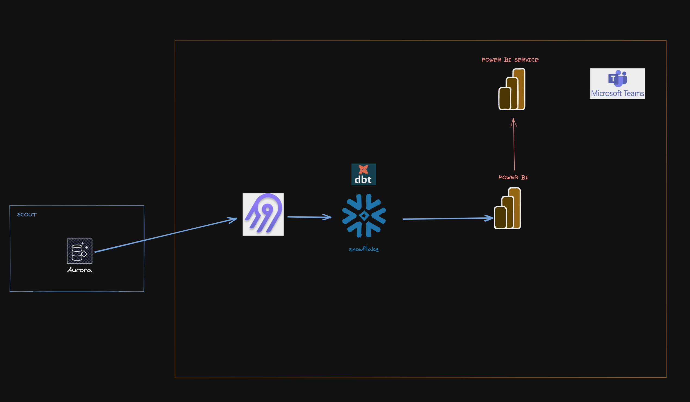

 

<h1 align="center"> <b> Simple End to End Data Engineering Pipeline for Natural Gas Production </b> </h1>
<h3 align="center"> Data Engineer Camp - Project #3 - Dec 2022 </h3>  

---

## Objective

Implement a grassroots data engineering pipeline and analytical process:
- Bring together disparate data sources (daily field data capture, SCADA, static attributes, oil and gas commodity prices, publically available well data)
- Establish single source of the truth
- Documented, version controlled, and automated transformations
- Incremental, authorized datasets published to BI tool and end users

## ROI

- Less engineering time on data correction and manual repetitive input:
30+ monthly reports, Regulatory audits, Master data management (VDR / Inventory)
- Make faster and better decisions:
Field studies or offset analysis, Well history and life cycle
- Incentivize field personnel to maximize asset profitability:  Performance Tracking, KPIs
- Build institutional memory and corporate workflows that last and scale for years beyond any particular tool or individual

## Source dataset

The initisal dataset is a hosted RDS instance of replicated production data

## Current Architecture

 
  

## Implementation Steps

### Extract and Load
- EC2 hosted Airbyte with scheduled connection runs

### Transform
- dbt core on Snoflake for staging and modeling

### Delivering project to End Users
- Power BI incrmeental loading to mobile service

## Roadmap and Challenges

- Hosted Airbyte with incremental + Upserts based on _updated_ column
- Snowflake cloud data warehousing
- dbt cloud for scheduled transformations
- Power BI with incremental refresh and incremental upload to Power BI Service for mobile and Teams integration
- Other possible enhancements:  Airflow with MWAA, Custom Connectors using the CDK or low-code option in Airbyte

Challenges:  appropriate _update_ column for incremental and upserts, cost management, communicating ROI to management, not cutting corners

